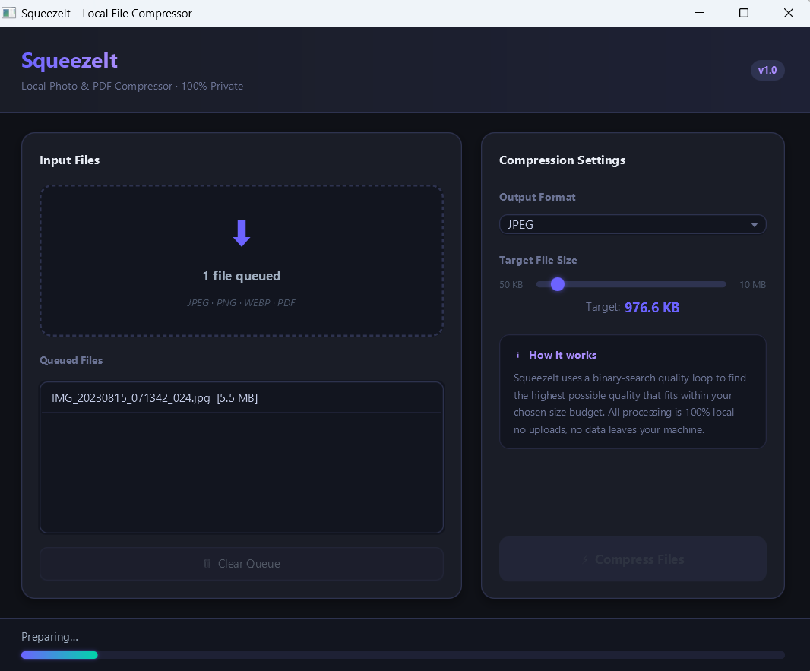

# 🗜️ SqueezeIt — Local Photo & PDF Compressor

<div align="center">


**A fast, beautiful, 100% local desktop app to compress images and PDFs — no cloud, no uploads, no subscriptions.**

</div>

---

## ✨ Features

| Feature | Detail |
|---------|--------|
| 🖼️ **Image Compression** | JPEG, PNG, WebP, BMP, GIF, TIFF input support |
| 📄 **PDF Generation** | Merge multiple images into a single A4 PDF |
| 🎯 **Target Size Control** | Binary-search quality loop — hits your exact size budget |
| 🚫 **100% Offline** | No data ever leaves your machine |
| ⚡ **Non-blocking UI** | All compression runs on background threads |
| 🌙 **Dark Mode UI** | Premium electric-violet dark theme |
| 📂 **Drag & Drop** | Native OS drag-and-drop file ingestion |
| 🔄 **Batch Processing** | Queue and process multiple files at once |

---

## 🖥️ Screenshots

<div align="center">



*SqueezeIt v1.0 — Dark-mode interface · 1 file queued · JPEG compression at 976.6 KB target · binary-search quality loop running*

</div>


---

## 🚀 Quick Start

### Prerequisites

| Requirement | Version | Check |
|-------------|---------|-------|
| Java JDK | 17 or higher | `java -version` |
| Apache Maven | 3.8+ | `mvn -version` |
| Internet | First run only (downloads deps) | — |

### 1. Clone / Open the Project

```powershell
cd c:\Users\sheva\antigravity\SqueezeIt
```

### 2. Run the App

**Option A — Double-click launcher (easiest)**
```
Double-click  run.bat  in File Explorer
```

**Option B — Maven command** *(from your own terminal, NOT inside Antigravity)*
```powershell
mvn javafx:run
```

> ⚠️ **Important:** Always launch from **your own** PowerShell / CMD / Windows Terminal.  
> Do not run inside a headless subprocess — JavaFX needs an interactive desktop session to display its window.

### 3. Compile Only

```powershell
mvn clean compile
```

---

## 📁 Project Structure

```
SqueezeIt/
│
├── pom.xml                          # Maven configuration & dependencies
├── run.bat                          # One-click Windows launcher
├── .mvn/
│   └── maven.config                 # Auto-injects -Djavafx.platform=win
│
└── src/
    └── main/
        ├── java/
        │   └── com/squeezeit/
        │       ├── MainApp.java          # JavaFX bootstrap entry point
        │       ├── MainController.java   # MVC controller (UI logic)
        │       └── CompressionEngine.java # Core compression algorithms
        │
        └── resources/
            └── com/squeezeit/
                ├── main-view.fxml        # Declarative UI layout
                └── styles.css            # Dark-mode stylesheet
```

---

## 🛠️ Tech Stack

| Component | Technology | Version |
|-----------|-----------|---------|
| Language | Java | 17 LTS |
| UI Framework | JavaFX | 21.0.2 |
| UI Layout | FXML + CSS | — |
| PDF Engine | Apache PDFBox | 3.0.2 |
| Image Engine | TwelveMonkeys ImageIO | 3.12.0 |
| Build Tool | Apache Maven | 3.8+ |
| Architecture | MVC (Model-View-Controller) | — |

---

## ⚙️ How the Compression Works

### Image Compression — Binary Search Quality Loop

```
Input Image
    │
    ▼
Decode with ImageIO (TwelveMonkeys extends support to WebP, TIFF etc.)
    │
    ▼
Binary Search: quality range [1.0 → 0.05], up to 14 iterations
    │
    ├─ Encode at quality = mid
    ├─ If output ≤ target → quality is a candidate, try HIGHER
    ├─ If output > target → try LOWER quality
    └─ Converge when hi - lo < 0.005
    │
    ▼
Write best candidate that fits within budget
    │
    ▼
Fallback: if even MIN_QUALITY exceeds budget → resolution down-scaling loop
```

### PNG Compression — Resolution Reduction

PNG is lossless, so quality parameters don't reduce file size meaningfully.  
SqueezeIt instead progressively scales down the image resolution (85% per step) until the output fits the target budget.

### Images → PDF Conversion

```
Multiple Images
    │
    ▼
Binary search JPEG quality across the full PDF
    │
    ▼
PDFBox: create PDDocument
    │
    ▼
For each image:
  - Embed as PDImageXObject (JPEGFactory)
  - Scale to fit A4 printable area (595 × 842 pt, 10mm margins)
  - Centre on page, preserve aspect ratio
    │
    ▼
Save final PDF
```

---

## 🎮 Usage Guide

### Compress an Image

1. Launch `run.bat` or `mvn javafx:run`
2. **Drag** image files onto the drop zone **or** click the zone to browse
3. Select **Output Format**: `JPEG`, `PNG`, or `WEBP`
4. Drag the **Target File Size** slider (50 KB → 10 MB)
5. Click **⚡ Compress Files**
6. Output files are saved **next to the originals** as `filename_squeezed.jpg`

### Merge Images into a PDF

1. Queue 2 or more images
2. Set **Output Format** to `PDF`
3. Set your target PDF size with the slider
4. Click **⚡ Compress Files**
5. A single `filename_squeezed.pdf` is created in the source folder

### Supported Formats

| Input Formats | Output Formats |
|---------------|---------------|
| JPEG / JPG | JPEG |
| PNG | PNG |
| WebP | WebP |
| BMP | PDF (from images) |
| GIF | — |
| TIFF / TIF | — |
| PDF (pass-through) | — |

---

## 🔧 Configuration

### Changing the Default Target Size

Edit `MainController.java`, line:
```java
sizeSlider.setValue(1_000_000);  // Default: 1 MB
```

### Changing the Slider Range

```java
sizeSlider.setMin(50_000);       // Minimum: 50 KB
sizeSlider.setMax(10_000_000);   // Maximum: 10 MB
```

### A4 Page Margins (PDF output)

Edit `CompressionEngine.java`:
```java
private static final float MARGIN = 28f;  // ~10 mm in PDF points
```

---

## 🐛 Troubleshooting

### Window doesn't appear
> **Cause:** JavaFX was launched from a headless subprocess (e.g., inside an IDE terminal or agent tool).  
> **Fix:** Open your own **Windows Terminal** or **PowerShell** and run `mvn javafx:run` or double-click `run.bat`.

### `${javafx.platform}` dependency error
> **Cause:** Maven can't resolve JavaFX native JARs without knowing the OS.  
> **Fix:** Already handled by `.mvn/maven.config` which injects `-Djavafx.platform=win` automatically. If you're on Linux/macOS, change `win` to `linux` or `mac`.

### `No ImageWriter found for format: WEBP`
> **Cause:** TwelveMonkeys WebP writer not on classpath.  
> **Fix:** Ensure `imageio-webp-3.12.0.jar` is in your local Maven repo (`~/.m2/repository/...`). Re-run `mvn compile -U` to force re-download.

### PDF is too large even at minimum quality
> **Cause:** Very large or many images; JPEG minimum quality still exceeds budget.  
> **Fix:** The engine will automatically fall back to resolution down-scaling. Alternatively, raise your target size slider.

---

## 🗺️ Roadmap

- [ ] **PDF → PDF re-compression** (extract embedded images, re-embed at lower quality)
- [ ] **Before/After preview pane** with thumbnail comparison
- [ ] **Batch rename** with custom prefix/suffix templates
- [ ] **History log** — persistent JSON record of all compression sessions
- [ ] **macOS / Linux support** (change `javafx.platform` in `.mvn/maven.config`)
- [ ] **Drag-to-reorder** queue items
- [ ] **System tray** integration for quick drop access
- [ ] **Executable JAR / Installer** packaged with jpackage

---

## 📦 Dependencies

```xml
<!-- JavaFX 21 (Windows) -->
org.openjfx:javafx-controls:21.0.2
org.openjfx:javafx-fxml:21.0.2
org.openjfx:javafx-graphics:21.0.2
org.openjfx:javafx-base:21.0.2

<!-- PDF Engine -->
org.apache.pdfbox:pdfbox:3.0.2

<!-- Extended Image Format Support -->
com.twelvemonkeys.imageio:imageio-jpeg:3.12.0
com.twelvemonkeys.imageio:imageio-webp:3.12.0

<!-- Logging -->
org.slf4j:slf4j-simple:2.0.13
```

---

## 🔒 Privacy

SqueezeIt processes everything **100% locally**:

- ✅ No network requests during compression
- ✅ No telemetry or analytics
- ✅ No account required
- ✅ Files never leave your machine
- ✅ Works completely offline after first Maven dependency download

---

## 📄 License

MIT License — free to use, modify, and distribute.

---

## 👤 Author

Built with ❤️ using Java 17 + JavaFX 21 + Apache PDFBox 3.x + TwelveMonkeys ImageIO.

---

## 🤖 Built with Antigravity AI

<div align="center">


</div>

This project was **created and evolved using [Google Antigravity](https://antigravity.dev)** — a state-of-the-art agentic AI pair-programming platform.

Rather than writing boilerplate by hand, the entire architecture was grown iteratively through AI-assisted engineering:

| What the AI did | How it helped |
|-----------------|---------------|
| 🏗️ **Scaffolded the Maven project** | Generated `pom.xml`, directory structure, and module wiring from scratch |
| ⚙️ **Engineered the compression algorithm** | Designed and coded the binary-search quality feedback loop in `CompressionEngine.java` |
| 🎨 **Designed the dark-mode UI** | Authored the full FXML layout and CSS stylesheet with electric-violet palette |
| 🔗 **Wired JavaFX concurrency** | Implemented background `Task` threading and real-time progress bar binding |
| 🐛 **Debugged platform issues** | Diagnosed and fixed the `${javafx.platform}` Maven classifier problem, FXML `placeholder` type error, and lambda variable capture bug |
| 📖 **Wrote all documentation** | Generated this README, project walkthrough, and inline code comments |

This is what **human + AI pair programming** looks like in practice — the engineer provides direction, domain knowledge, and validation; the AI handles implementation speed, recall of APIs, and debugging depth.

> *"By combining agentic AI pair-programming with deep domain engineering, this application was built iteratively — from Maven dependency wiring to custom binary-search compression loops, JavaFX threading models, and full dark-mode UI design."*

---

<div align="center">

**SqueezeIt v1.0** · Java 17 · JavaFX 21 · Windows

*Compress smarter. Stay private. Build faster with AI.*

🤖 *Built with [Google Antigravity](https://antigravity.dev)*

</div>
